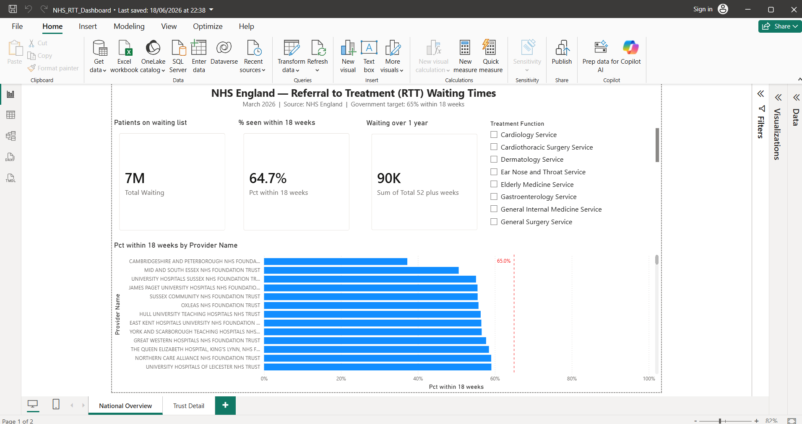

# NHS England RTT Waiting Times Analysis
### Excel | Power BI | DAX | Real Government Data | March 2026

---

## The Problem

The NHS has 7.1 million patients waiting for treatment as of March 2026.
The government set an interim target that 65% of patients should begin
treatment within 18 weeks of referral. That target was missed.

This project analyses the real, live NHS England RTT (Referral to
Treatment) monthly data release to find exactly where the problem is
worst — which hospital trusts, which specialties, and by how much.

---

## Key Findings

**Overall performance**
Only 60.2% of trust-specialty combinations across England are meeting
the 65% target. 391 combinations (16.3%) are rated Red — seriously
missing the target. A further 566 (23.5%) are rated Amber.

**Worst performing trust**
Cambridgeshire and Peterborough NHS Foundation Trust has the lowest
18-week performance in England at 37.2% — 27 percentage points below
the government's 65% target.

**Worst specialty backlog**
Trauma and Orthopaedics has 15,492 patients waiting over 52 weeks
nationally — the highest absolute backlog of any specialty in England.

---

## What I Built

**Excel (data cleaning and analysis)**
- Downloaded the live NHS England RTT Incomplete Provider dataset
  (March 2026, ~3,600 rows across 140+ hospital trusts)
- Removed title rows, deleted blank columns, converted the range into
  a structured Excel Table
- Built a RAG status classification column using a nested IF formula,
  with a zero-patient check to prevent misleading labels
- Used COUNTIF with absolute references to produce a national RAG
  summary (Green: 1,447 / Amber: 566 / Red: 391 / N/A: 1,195)
- Built pivot tables with calculated fields to rank trusts and
  specialties by waiting time performance

**Power BI dashboard (2 pages)**
- Page 1 — National Overview: 3 KPI cards (Total Waiting, % within
  18 weeks, Patients over 52 weeks), sorted bar chart of worst trusts,
  specialty slicer with cross-filtering
- Page 2 — Trust Detail: provider slicer with full specialty breakdown
  table and RAG status per row
- DAX measures: Total Waiting (SUM), Pct Within 18 Weeks (DIVIDE),
  Patients Over 52 Weeks (SUM)

---

## Tools Used

| Tool | What it was used for |
|------|----------------------|
| Excel | Data cleaning, pivot tables, RAG formula, COUNTIF summary |
| Power BI Desktop | Interactive 2-page dashboard |
| DAX | SUM, DIVIDE measures for KPI cards |

---
## Dashboard Preview

## Files in This Repository

| File | Description |
|------|-------------|
| `NHS_RTT_Working_Mar26.xlsx` | Cleaned working file with RAG status column and pivot analysis |
| `dashboard_screenshot.png` | Screenshot of the finished Power BI dashboard |
| `README.md` | This file |

---

## Data Source

NHS England RTT Waiting Times Statistics — publicly available monthly
release, no login required.

https://www.england.nhs.uk/statistics/statistical-work-areas/rtt-waiting-times/rtt-data-2025-26/

---

## About This Project

This was a self-led portfolio project built on real government data
rather than a practice dataset, to demonstrate data cleaning, analysis,
and dashboard-building skills using tools relevant to analyst roles in
the UK public and private sector.
